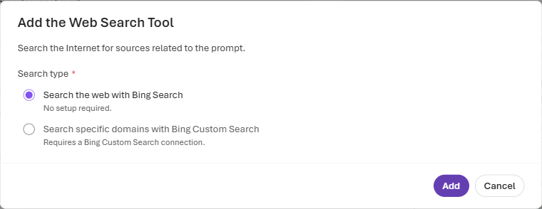
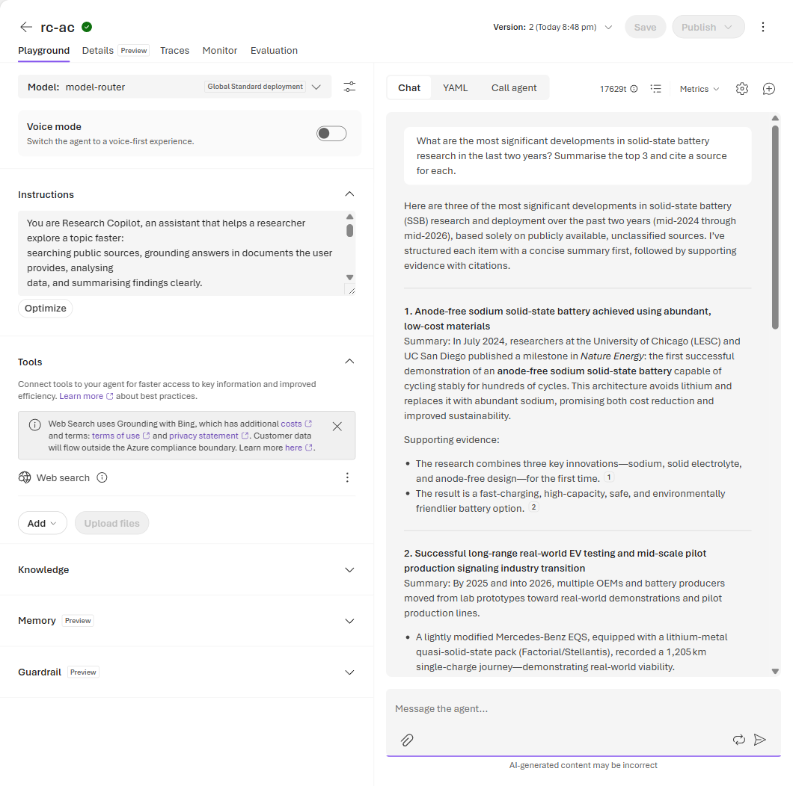
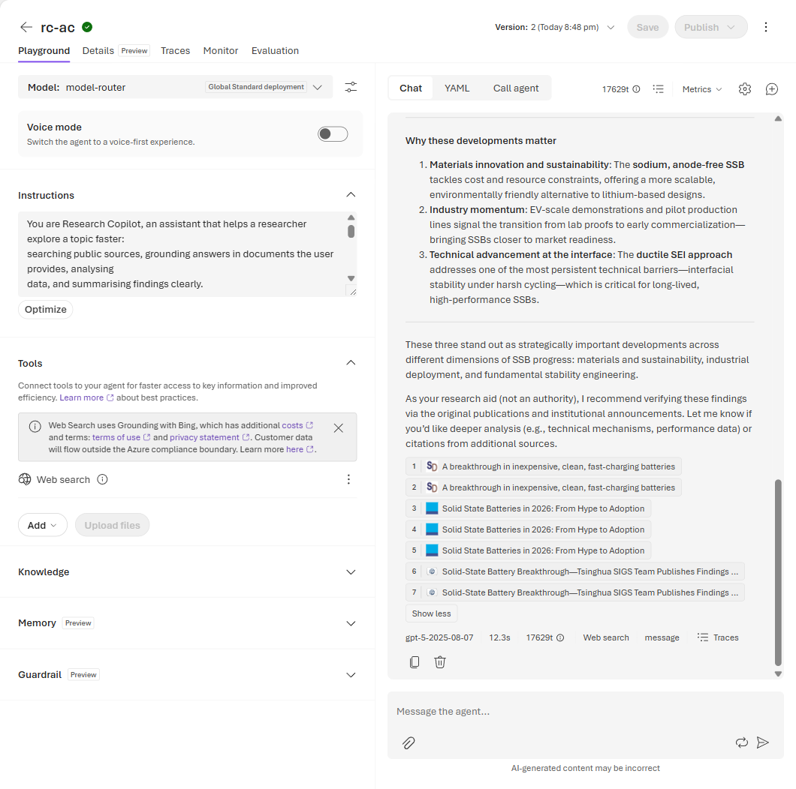
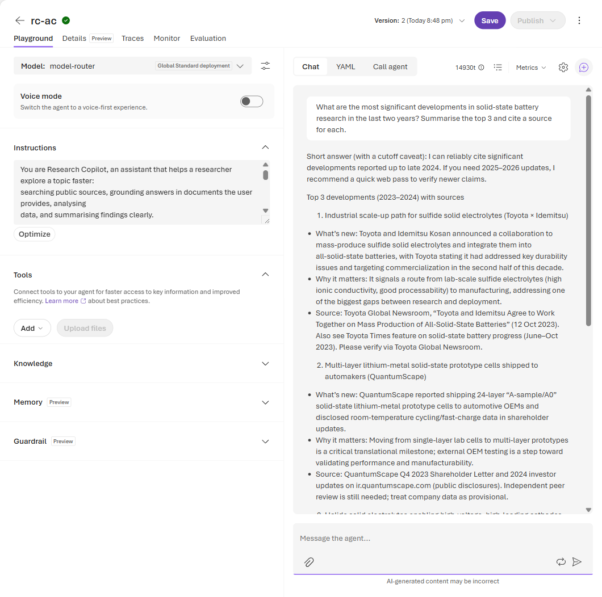

# Lab 1 (Portal Walkthrough) — Search the Literature 🔎

**This is the screenshot-by-screenshot version of [Lab 1](./lab-01-search-the-literature.md) for the
🟢 Explore (portal) rail.** You take the `rc-<your-initials>` agent from Lab 0 and give it a live
window onto the public web, so it answers with **current, cited** information instead of stale model
memory — and shows you *where* every claim came from.

> **Why it matters for research:** a model's training data has a cutoff. Web Search lets the agent
> pull in this week's papers, news, and pages, and attach a clickable source to each claim so you can
> verify it yourself.

> ### ⚠️ Same rule as always: public / unclassified data only
> Web Search sends your query to **Bing (Grounding with Bing)**, so that text leaves the Azure
> compliance boundary — the portal shows you a cost-and-terms note right in the **Tools** panel. Keep
> your prompts public and unclassified, exactly as in Lab 0.

**Before you start**
- You've completed [Lab 0](./lab-00-portal.md) and still have your `rc-<your-initials>` agent open on
  its build page in the **Foundry portal** ([ai.azure.com](https://ai.azure.com)).
- Leave the **Model** on **`model-router`** — Web Search works on the teaching default, no model switch
  needed. *(If a web-search query ever errors, switching the model to `gpt-5.4` is a reliable fallback,
  but you shouldn't need it.)*

---

## Step 1 — Confirm the Web Search tool (search type)

The current Foundry portal **attaches Web Search to new agents by default**, so you'll usually see it
already listed under **Tools** (with a *Grounding with Bing* cost note). You don't need to add it
again — just confirm the search type: open the tool's **Actions (⋮) → Edit** (or **Tools → Add → Web
Search** if it isn't there). Under **Search type**, keep **"Search the web with Bing Search" (No setup
required)** — **not** *"Search specific domains with Bing Custom Search"*, which needs a Bing Custom
Search connection you don't have.

*Keep the default **Search the web with Bing Search** — no connection or key to provision. Your
facilitator will also point out the **search context size** option (how much of each page the agent
reads); you'll meet that as `search_context_size` on the 🔵 SDK rail.*

---

## Step 2 — Ask a current, cited research question

In the **Message the agent…** box, ask something that needs *recent* public information:

> *"What are the most significant developments in solid-state battery research in the last two years?
> Summarise the top 3 and cite a source for each."*

*(Swap in **your own field** — that's the point.)*

*With Web Search attached (see the **Tools** panel on the left), the agent returns a structured
top-3 with **inline numbered citations** — each `[1] [2] …` maps to a real page it just read. Under
the reply, a badge shows the model `model-router` picked, the latency, and a **Web search** marker so
you know the answer was grounded, not recalled.*

---

## Step 3 — Inspect the citations

Grounding is only useful if you check it. Expand the sources under the reply (click the **+N** chip to
show them all) and click through to at least one. Are they credible? Recent?

*The expanded list turns each citation into a **clickable source card** — here a mix of a news-science
site, an industry analysis, and a university announcement, all dated within the last two years. This is
the habit to build: treat the agent as a research aid and **verify at the source**.*

---

## Step 4 — A/B it: Web Search on vs off

You've just seen the **on** case. Now feel the difference: open the Web Search tool's **Actions (⋮) →
Remove**, start a **New chat**, and ask the *exact same question* again.

*With the **Tools** panel now empty, the same question produces a visibly weaker answer: it opens with a
**training-cutoff caveat** ("reported up to late 2024… I recommend a quick web pass"), falls back to
older examples, and cites from memory with hedges like "Please verify" — no clickable source cards,
no **Web search** badge. **This on-vs-off contrast is the whole lesson**, and it's exactly why the
portal now enables Web Search by default.*

When you're done, **re-add** the Web Search tool (**Tools → Add → Web Search → Add**) so your agent is
grounded again for the next lab.

### ✅ Checkpoint
The grounded answer names **3 developments**, each with a **clickable, recent source**, and visibly
beats the no-tool version.

---

## 🧹 Clean up (shared project)

Nothing new to delete for this lab — you've re-added Web Search so the agent is ready for Lab 2. If
you're stopping here, you can remove your `rc-<initials>` agent from **Build → Agents** via its
**Actions (…) → Delete**; keep it if you're continuing.

---

## 💡 Go further
- Ask a **comparison** question (e.g. *"Compare two methods and cite each"*) and watch it synthesise
  across several pages in one grounded answer.
- On the 🔵 SDK rail, dial `search_context_size` from `"low"` → `"high"` and watch depth vs. speed
  change.

➡️ **Next:** [Lab 2 — Ground on your papers](./lab-02-ground-on-your-papers.md)
