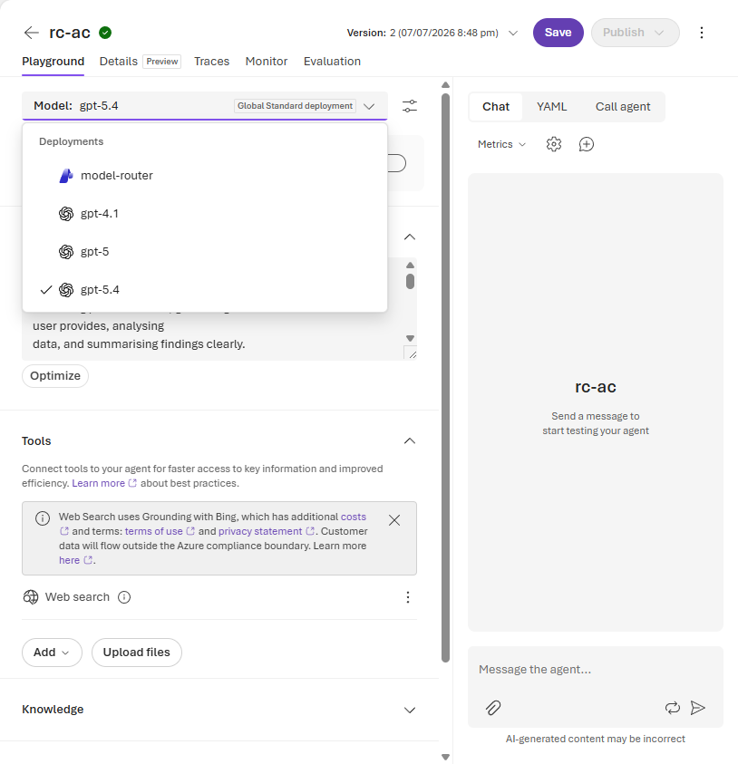
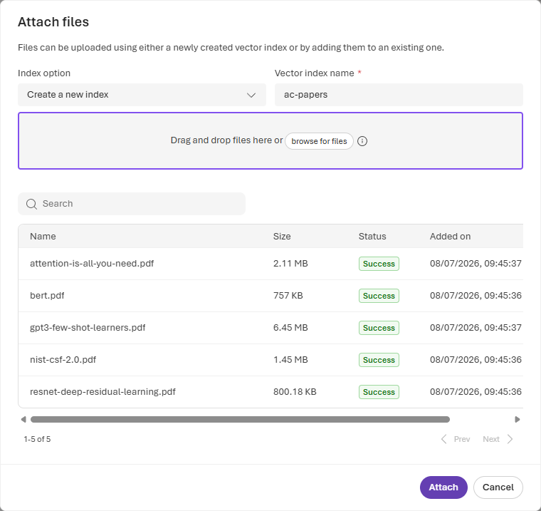
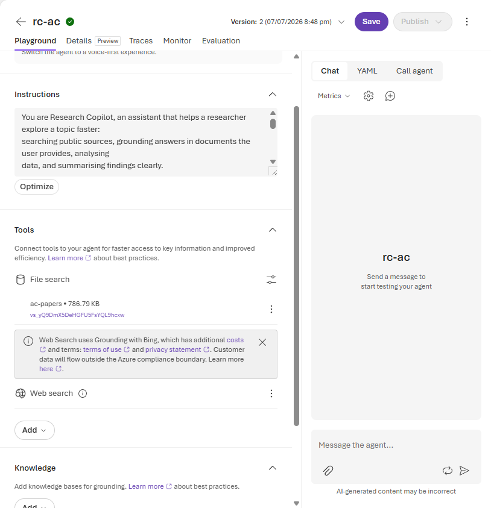
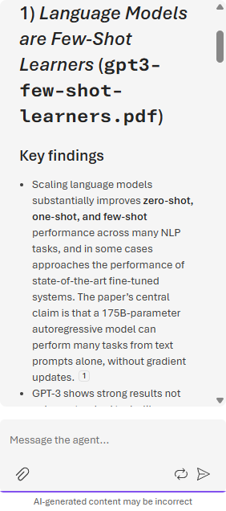
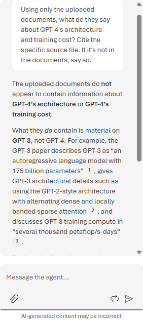

# Lab 2 (Portal Walkthrough) — Ground on Your Papers 📚

**This is the screenshot-by-screenshot version of [Lab 2](./lab-02-ground-on-your-papers.md) for the
🟢 Explore (portal) rail.** You point the `rc-<your-initials>` agent from Lab 1 at **your own**
documents, so it answers from *them* — and cites the exact file — instead of the open web. This is
Retrieval-Augmented Generation (RAG).

> **Why it matters for research:** your most valuable context (papers you're reading, reports, notes)
> isn't on the public web. File Search lets the agent read *your* corpus and ground every claim in a
> specific source you can open — and, just as importantly, say *"that isn't in your documents"* rather
> than guess.

> ### ⚠️ Same rule as always: public / unclassified documents only
> Everything you index here is uploaded to the **shared project** vector store. Use open-access papers,
> public reports, or your own non-sensitive notes. **No classified or personal material.**

**Before you start**
- You've completed [Lab 1](./lab-01-portal.md) and still have your `rc-<your-initials>` agent open on
  its build page in the **Foundry portal** ([ai.azure.com](https://ai.azure.com)).
- Have **3–10 public documents** ready (PDF / MD / TXT / DOCX). No materials of your own? Use the
  facilitator's **open-access starter pack**.

---

## Step 1 — Switch the model to `gpt-5.4` (this unlocks File Search)

File Search is **not** supported on `model-router` in the portal — on that model the **Upload files**
button is greyed out, and forcing the tool gives *"File search tool doesn't work with the model you
selected."* Open the **Model:** selector at the top of the config panel and pick **`gpt-5.4`**.

*The dropdown lists the deployments available in this project (`model-router`, `gpt-4.1`, `gpt-5`,
`gpt-5.4`); pick **`gpt-5.4`** (the check mark). The moment you switch, the **Upload files** button
under **Tools** wakes up. Your change shows in the playground straight away — **Save** it to keep the
agent on `gpt-5.4` for the rest of the portal labs, which all rely on it.*

---

## Step 2 — Upload your documents and name the index

Scroll to the **Tools** section and click **Upload files** (it sits next to **Add** — *not* the
separate **Knowledge** panel further down). In the **Attach files** dialog, keep **Create a new index**,
then **replace the auto-generated Vector index name with one you'll recognise — include your initials**,
e.g. **`<initials>-papers`**. Drag in (or **browse for**) your documents and wait for every row to reach
**Success**.

*Here the index is named **`ac-papers`** and the five open-access papers have all finished indexing
(**Success**), so **Attach** lights up. **Why rename it?** Everyone shares one project, so the vector
indexes are listed together — your initials make *yours* easy to find and avoid confusion with a
neighbour's.*

---

## Step 3 — Confirm File Search is attached

Click **Attach**. Back on the agent, **File Search** now appears under **Tools**, showing your vector
store — right alongside the **Web Search** tool from Lab 1.

*The **File search** entry lists your index (**`ac-papers`**) with its size and vector-store ID
(`vs_…`). The agent now has **two** grounding tools — your papers **and** the live web — and the chat is
clean and ready to test.*

---

## Step 4 — Ask a grounded question

In the **Message the agent…** box, ask it to summarise *only* from your files and cite each point:

> *"Using only the documents I uploaded, summarise the key findings and methods. Cite the specific
> source file for each point. If something isn't in the documents, say so."*

*The reply is organised **per source**, and each section names the exact file it came from — here
`gpt3-few-shot-learners.pdf` right in the heading — with inline citation chips (`[1]`) you can click to
open the passage. Every claim traces back to a document you provided, not to the model's memory.*

---

## Step 5 — Test its honesty

Grounding is only trustworthy if the agent will admit what it *doesn't* have. Start a **New chat** and
ask for something you *know* isn't in the corpus — for example, a detail about a newer model than any of
your papers cover.

*Asked about **GPT-4** — which none of the uploaded papers discuss — the agent says plainly that
**"GPT-4 architecture: not stated. GPT-4 training cost: not stated,"** then helpfully points to what the
corpus *does* contain (the **GPT-3** paper) with citations. That refusal to invent is exactly the
behaviour you want from a research aid.*

### ✅ Checkpoint
Answers are **grounded in your files with per-source citations**, File Search shows your
`<initials>-papers` index under **Tools**, and the agent **declines** to answer what isn't in the
corpus.

---

## 🧹 Clean up (shared project)

Keep your agent on **`gpt-5.4`** — Labs 3–5 all use it. If you're stopping here, you can tidy the shared
project: open **File search → Actions** and remove your `<initials>-papers` index, and optionally remove
your `rc-<initials>` agent from **Build → Agents** via its **Actions (…) → Delete**. Keep both if you're
continuing.

---

## 💡 Go further
- **Combine both tools:** you already have **Web Search** *and* **File Search** attached — ask a question
  that needs both (e.g. *"How do my uploaded papers define X, and how does that compare to what's
  published this year?"*) and watch it ground on your corpus **and** check the live web in one answer.
- Ask for a **literature-review table** (method · dataset · result · source file) across your corpus.

➡️ **Next:** *Break (10 min)*, then [Lab 3 — Analyse the data](./lab-03-analyse-the-data.md)
