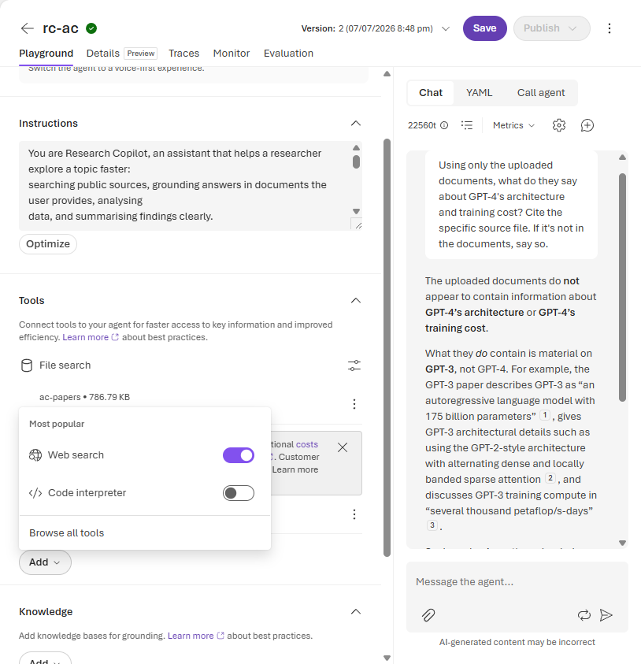
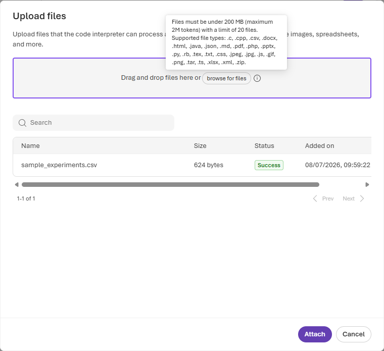
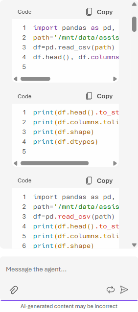
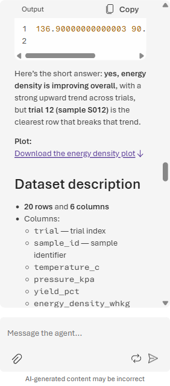
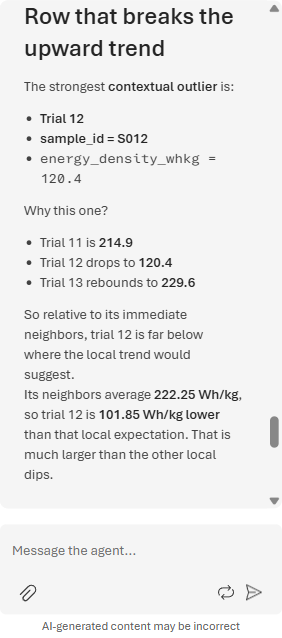

# Lab 3 (Portal Walkthrough) — Analyse the Data 📊

**This is the screenshot-by-screenshot version of [Lab 3](./lab-03-analyse-the-data.md) for the
🟢 Explore (portal) rail.** You give the `rc-<your-initials>` agent a **hosted Python sandbox** so it
can *actually run code* on a dataset — computing exact statistics and drawing a chart — instead of
estimating in its head.

> **Why it matters for research:** language models are unreliable at arithmetic and stats. The Code
> Interpreter lets the agent *compute* — so a mean is a real mean and a trend is a real fit. You bring
> the question; it writes and runs the Python, then explains the result in plain language.

> ### ⚠️ Reminder: public / synthetic data only
> This lab uses the small **synthetic** dataset shipped in the repo
> (`assets/data/sample_experiments.csv`). Use it, or your own **public / unclassified** CSV. **Never**
> upload sensitive or personal data to the sandbox.

**Before you start**
- You've completed [Lab 2](./lab-02-portal.md) and still have your `rc-<your-initials>` agent open on
  its build page in the **Foundry portal** ([ai.azure.com](https://ai.azure.com)), on **`gpt-5.4`**.
- You know where `assets/data/sample_experiments.csv` is on disk (20 rows: `trial`, `sample_id`,
  `temperature_c`, `pressure_kpa`, `yield_pct`, `energy_density_whkg`).

---

## Step 1 — Add the Code Interpreter tool

Scroll to the **Tools** section and click **Add**. In the **Most popular** menu, flip on
**Code interpreter** — it sits right under **Web search** (from Lab 1); **File search** (from Lab 2)
stays attached too. Tools are cumulative, which is exactly what you want.

*The **Add** menu lists the most popular tools; toggle **Code interpreter** on. Once enabled it appears
as its own row under **Tools**, alongside **File search** and **Web search** — the agent now has three
capabilities and can pick whichever a question needs.*

---

## Step 2 — Upload the CSV to Code Interpreter

Here's the one gotcha the main lab glosses over: in the current portal you **can't** drop a CSV into the
chat box — the composer's paperclip only accepts images and PDFs. Instead, attach data **at the tool
level**: on the **Code interpreter** row under **Tools**, click **Files**, then **browse for files** and
pick `sample_experiments.csv`. Wait for the row to reach **Success**, then click **Attach**.

*The **Upload files** dialog on the Code interpreter tool accepts spreadsheets and data files — the
tooltip spells out `.csv`, `.xlsx`, `.json`, and more. Our 20-row CSV uploads in a second (**Success**),
and **Attach** binds it to the sandbox so the agent can read it by path.*

---

## Step 3 — Ask the question and watch it write code

Start a **New chat** and paste the analysis prompt:

> *"Describe this dataset. Compute summary statistics for each numeric column, plot
> `energy_density_whkg` over `trial`, and tell me whether it's improving. Then identify the row that
> breaks that upward trend (a contextual outlier vs. its neighbours) and explain why."*

The agent doesn't guess — it **writes Python and runs it** in the sandbox, step by step.

*You can watch it work: it loads the CSV with **pandas**, inspects shape and dtypes, then computes
`describe()` and fits the trend. Each **Code** block is real code executed server-side — the numbers in
the reply come from that run, not from the model's memory.*

---

## Step 4 — Read the computed result

When the run finishes, the agent leads with the verdict, links the chart, and describes the data.

*It reports the trend is genuinely **improving** — start-to-end **+90.5 %** (about **+6.76 Wh/kg per
trial**, correlation **0.858**) — and already names **trial 12 (sample `S012`)** as the row that breaks
it. Note the **Plot:** line: in the current portal the chart comes back as a **downloadable file**
(`energy_density_over_trial.png`) via the **Download the energy density plot** link rather than rendering
inline — click it to open the chart (energy density climbing across trials, with a sharp dip at trial 12).*

---

## Step 5 — The row that breaks the trend

The payoff is the **contextual outlier** — a point that's only wrong *relative to its neighbours*, which
a plain min/max check would miss.

*The agent pinpoints **trial 12 / `S012`** at **120.4 Wh/kg**, sitting between trial 11 (**214.9**) and
trial 13 (**229.6**) — about **101.85 Wh/kg below** the local expectation, far bigger than any other dip.
It even goes further than asked and explains *why*: trial 12's `temperature_c`, `pressure_kpa`, and
`yield_pct` all collapse versus its neighbours, so it reads as **weaker operating conditions**, not
random noise. The response footer confirms it ran on **`gpt-5.4`** using the **Code interpreter** tool.*

### ✅ Checkpoint
The agent **wrote and ran Python** on your CSV, produced **computed statistics** and a **chart** (offered
as a downloadable plot), reported that energy density is **improving across trials**, and flagged
**`S012` (trial 12)** as the row that **breaks the trend** — with a neighbour-relative explanation.

---

## 🧹 Clean up (shared project)

Keep your agent on **`gpt-5.4`** — Labs 4–5 still use it. If you're tidying the shared project, open the
**Code interpreter** tool's **Files** and remove `sample_experiments.csv`, and (optionally) turn the tool
off via its **Actions (…)**. Leave **File search** and **Web search** attached if you're continuing.

---

## 💡 Go further
- Ask it to **fit a linear regression** of `energy_density_whkg` on `trial` and report slope + R².
- Ask for a **cleaned dataset** with `S012` removed, then re-plot and compare the trend.
- Ask a **cross-tool** question that mixes Lab 2 and Lab 3 (e.g. *"Do my uploaded papers suggest a reason
  a run like trial 12 would underperform?"*) so it reaches for **File search** and **Code interpreter**
  together.

---

⬅️ **Previous:** [Lab 2 (portal) — Ground on your papers](./lab-02-portal.md) · ➡️ **Next:** [Lab 4 (portal) — Add a tool](./lab-04-portal.md)
