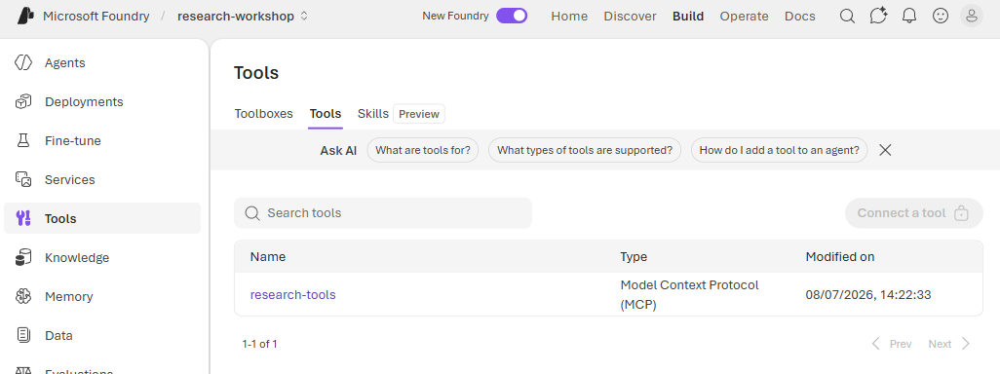
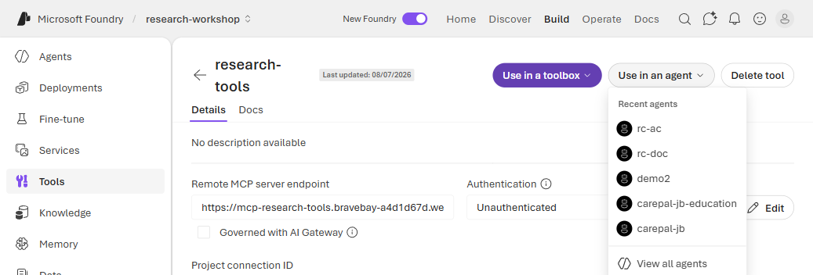
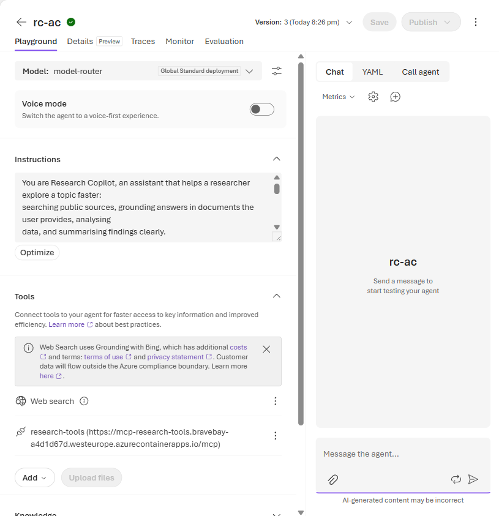
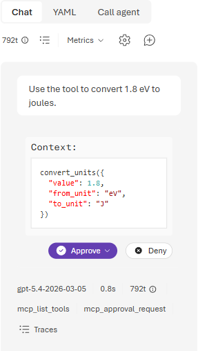
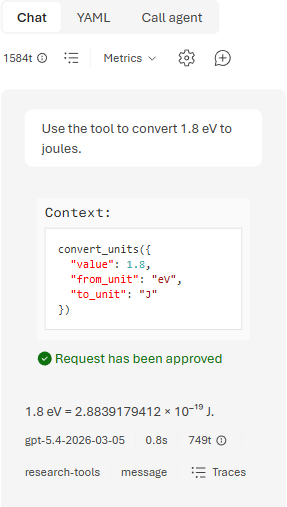
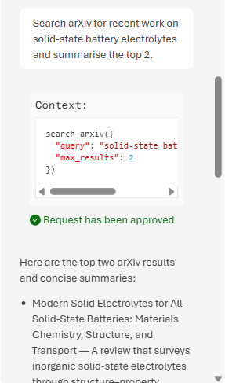

# Lab 4 (Portal Walkthrough) — Add a Tool 🔧

**This is the screenshot-by-screenshot version of [Lab 4](./lab-04-add-a-tool.md) for the 🟢 Explore
(portal) rail.** You give the `rc-<your-initials>` agent an **action** it can call — an external
**MCP** (Model Context Protocol) tool server — so it stops *guessing* at things like exact unit
conversions or the latest papers and instead **calls out** to real code and cites the result. This
is what turns a chatbot into an *agent*.

> **Why it matters for research:** the agent can't reliably know everything — a precise conversion, a
> lookup, a live search. Tools let it call **trustworthy code or services** and use the real answer.
> And because every call pauses for your **approval**, you stay in the loop: you see exactly what it
> wants to run before it runs.

> ### ⚠️ One shared tool, created for you
> Adding an MCP server from scratch (**Tools → Add → Custom → MCP**) needs **Foundry Owner** rights,
> which workshop participants don't have. So your facilitator has already registered the workshop
> server **once** as a shared tool called **`research-tools`**. You don't paste any URL — you just
> **attach the existing tool** to your agent. See the [facilitator note](#-go-further) below for the
> one-time admin step.

**Before you start**
- You've completed [Lab 3](./lab-03-portal.md) and have your `rc-<your-initials>` agent in the
  **Foundry portal** ([ai.azure.com](https://ai.azure.com)).
- Your facilitator confirms the shared **`research-tools`** MCP tool is available in the project
  (they set it up via [admin/03-deploy-mcp-server.md](../admin/03-deploy-mcp-server.md)). It exposes
  two tools: **`convert_units`** (eV↔J, nm↔m, Å↔m, kPa↔atm, °C↔K) and **`search_arxiv`** (live
  search of the public [arXiv](https://arxiv.org/) API).

---

## Step 1 — Find the shared research tool

In the **left navigation**, click **Tools**. On the **Tools** tab you'll see **`research-tools`**
already listed, typed as **Model Context Protocol (MCP)** — the one server your facilitator
registered for everyone.

*The **Tools** area (left nav) lists tools registered in the project. **`research-tools`** is here as a
**Model Context Protocol (MCP)** tool — you don't need to create it. (Notice **Connect a tool** is
greyed out for your role; that's expected, and it's exactly why an admin pre-created this one for the
whole room.)*

---

## Step 2 — Use it in your agent

Click **`research-tools`** to open it, then click **Use in an agent** and pick your
**`rc-<your-initials>`** agent from the **Recent agents** list (or **View all agents**).

*The tool's detail page shows its remote **`…/mcp`** endpoint and **Unauthenticated** access. **Use in
an agent** attaches this shared tool straight to your agent — no owner rights, no URL typing, no
per-person setup.*

---

## Step 3 — Confirm it's attached

You land back on your agent's build page. Under **Tools**, **`research-tools`** now sits alongside
**Web search** — the agent can now call `convert_units` and `search_arxiv` when a question needs them.

*Tools are cumulative: **Web search** (Lab 1) stays, and **`research-tools`** joins it. The row shows
the same **`…/mcp`** endpoint from Step 2, so you can confirm you attached the right server.*

---

## Step 4 — Ask a question and approve the call

In the **Chat** panel, ask:

> *"Use the tool to convert 1.8 eV to joules."*

The agent doesn't answer from memory — it **pauses and asks permission**, showing exactly what it
wants to run.

*This is the human-in-the-loop moment. The agent proposes a call — `convert_units({ "value": 1.8,
"from_unit": "eV", "to_unit": "J" })` — and waits. The **Approve** button offers **Approve once**,
**Always approve this tool**, or **Always approve all tools**; there's also **Deny**. Choose **Approve
once** to review every call (this is the portal's equivalent of the main lab's *require approval =
always*).*

---

## Step 5 — Read the computed result

Once you approve, the tool actually runs and its **real result** flows back into the answer.

*The reply reads **1.8 eV = 2.8839179412 × 10⁻¹⁹ J** — an exact conversion computed by the tool, not
an estimate the model made up. The footer confirms it ran the **`research-tools`** MCP call.*

---

## Step 6 — Try the live arXiv search

Now use the other tool. Ask:

> *"Search arXiv for recent work on solid-state battery electrolytes and summarise the top 2."*

Approve the call, and the agent searches the **live** arXiv API and summarises what it actually found.

*The agent calls `search_arxiv({ "query": "solid-state battery electrolytes", "max_results": 2 })`,
then summarises **real papers with links** — leading with a directly relevant review on solid-state
electrolytes. Note it's also **honest**: when its second hit is only tangentially related, it says so
and offers to refine the search. Grounded, cited, and candid — that's the point of a tool.*

### ✅ Checkpoint
The agent **calls a tool** (you approve it) and answers using the **tool's real result** — an exact
unit conversion and live arXiv papers — instead of guessing.

---

## 🧹 Clean up (shared project)

The `research-tools` tool is **shared** — please **don't delete it** (everyone uses the same one). If
you're tidying your own agent, you can remove `research-tools` from **its** Tools list via the row's
**Actions (…)**; that only detaches it from your agent and leaves the shared tool intact. Leave
**Web search** attached if you're continuing to Lab 5.

---

## 💡 Go further
- Try **Always approve this tool** on a call, then ask another convert/search question — notice it
  now runs without pausing. Handy once you trust a tool; **Approve once** keeps the tightest control.
- Ask a **cross-tool** question that mixes labs (e.g. *"Search arXiv for solid-state electrolyte
  reviews, then convert 2.5 eV to joules"*) and watch it fire **`search_arxiv`** and **`convert_units`**
  in one turn.
- Ask something the tool **can't** do (e.g. a conversion it doesn't support) and see how it responds —
  a good way to feel the boundary between "call the tool" and "answer directly."

> **Facilitator note:** participants can't create this MCP connection themselves — the create path
> (**Tools → Add → Custom → MCP → Connect**) is **gated on Foundry Owner**, so for a **Foundry User**
> the **Connect** button stays disabled even with a valid `…/mcp` URL. That's why an **admin registers
> the server once** as the shared **`research-tools`** connection and everyone else just **attaches it**
> via **Tools → Use in an agent** (the steps above). Approval then defaults to prompting on every call
> (choose **Approve once**), which matches the main lab's *require approval = always* intent. See the
> **"Register it as a shared tool"** section in
> [admin/03-deploy-mcp-server.md](../admin/03-deploy-mcp-server.md) for the one-time admin step.

---

⬅️ **Previous:** [Lab 3 (portal) — Analyse the data](./lab-03-portal.md) · ➡️ **Next:** [Lab 5 (portal) — Take it home](./lab-05-portal.md)
