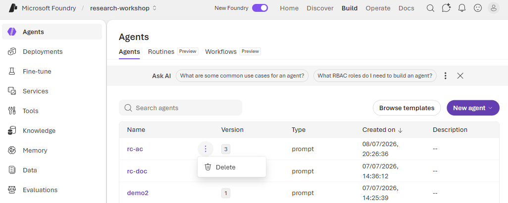
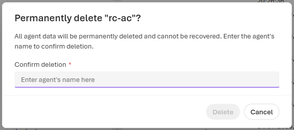

# Lab 5 (Portal Walkthrough) — Take It Home 🎒

**This is the portal version of [Lab 5](./lab-05-take-it-home.md).** It's a wrap-up, so there's only
one hands-on portal action — **tidying up the shared project by deleting the agent you built** — plus
the ideas worth carrying home. You started with a plain chat agent and gave it four research
superpowers across the labs:

| Lab | Superpower | Foundry feature |
|-----|------------|-----------------|
| [1](./lab-01-portal.md) | **Search** the live literature, with citations | Web Search |
| [2](./lab-02-portal.md) | **Ground** answers in your own documents | File Search / RAG |
| [3](./lab-03-portal.md) | **Compute** real stats & charts on data | Code Interpreter |
| [4](./lab-04-portal.md) | **Act** by calling tools / services | Function calling · MCP |

Together that's an **agentic research assistant**: it can find, read, calculate, and do — and tell you
where every answer came from.

> **Why it matters for research:** the power comes with responsibility. A research aid that invents
> sources, or that touches data it shouldn't, is worse than none. The habits below are the point of the
> whole workshop.

---

## 🧭 Responsible AI for research (the part that matters most)
- **Cite or decline.** Ground claims in real sources and admit uncertainty — never invent a citation.
- **Unclassified by default.** Everything today was public / synthetic on purpose. For real work, match
  the data's classification to an approved environment before you connect it.
- **Human-in-the-loop.** Tools that *act* used **approval** (you saw this in [Lab 4](./lab-04-portal.md))
  — keep a person on consequential steps.
- **Verify, then trust.** Treat outputs as a fast first draft a domain expert checks, not a verdict.

---

## Step 1 — Find your agent and open its Actions menu

In the **left navigation**, click **Agents**. Find the **`rc-<your-initials>`** agent(s) you created,
hover the row, and open the **Actions (⋮)** menu — then choose **Delete**.

*Each agent row has an **Actions (⋮)** menu. Only delete the agents **you** created (`rc-<your-initials>`);
leave everyone else's alone — this is a shared project.*

---

## Step 2 — Confirm the deletion

Deleting an agent is permanent, so the portal asks you to **type the agent's name** to confirm. The
**Delete** button stays disabled until the name matches.

*This type-to-confirm guardrail means you can't delete by accident. Type the exact agent name, click
**Delete**, and the row disappears from the list. (Not deleting after all? Just click **Cancel**.)*

### ✅ Checkpoint
The agents you created (`rc-<your-initials>*`) are gone from the **Agents** list, leaving the shared
project tidy for the next group.

---

## 🚀 Where to go next
- **Evaluate & observe:** measure quality before anything leaves a demo. Try the bonus labs —
  [Evaluate in the portal](./bonus/bonus-01-evaluate-in-portal.md) and
  [Cloud evaluation with the SDK](./bonus/bonus-02-cloud-evaluation-sdk.md) — to run **evaluators**
  (relevance, coherence, groundedness, safety) over a dataset or your own agent.
- **Orchestrate:** chain several agents/tools with **Workflow agents** or the **Microsoft Agent
  Framework** for multi-step research pipelines.
- **Deploy:** publish your agent as a **hosted agent** so a teammate (or app) can call it.

## ✍️ Apply it to your work (pick one, 2 min)
- *Which of the four superpowers would save you the most time this month?*
- *What public corpus would you point [Lab 2](./lab-02-portal.md) at?*
- *What's one tool (an internal API, a calculation) you'd want in [Lab 4](./lab-04-portal.md)?*

---

**Thank you — go supercharge your research!** 🔬✨

---

⬅️ **Previous:** [Lab 4 (portal) — Add a tool](./lab-04-portal.md) · ➡️ **Next:** [Bonus labs — Evaluate & observe](./bonus/README.md) · ↩️ Back to [the workshop overview](../README.md)
